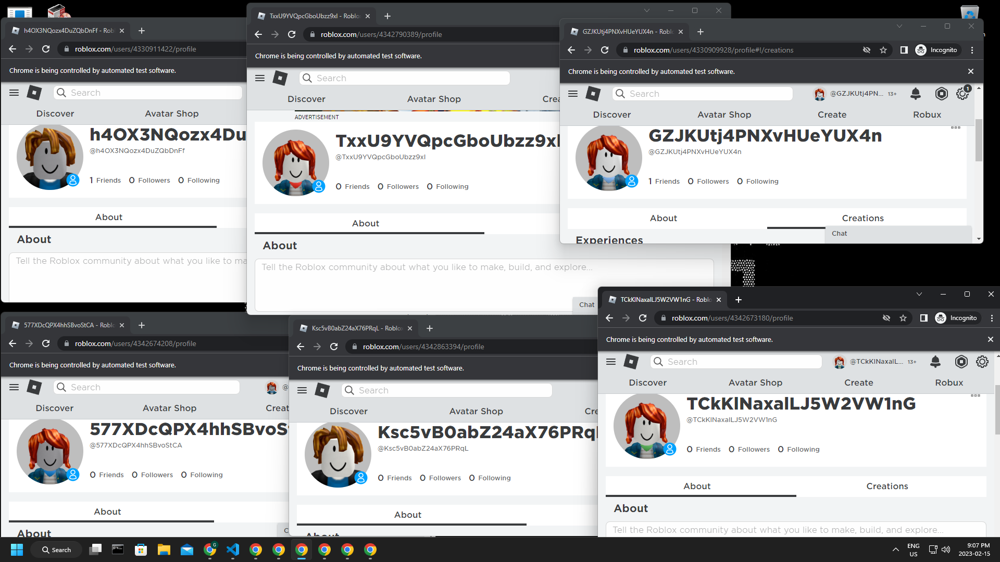

# Roblox Bot Generator

Easily generate and log in to Roblox accounts.



## Instructions

### Driver

The generator depends on the Selenium Python library, which requires a browser driver. I used Google Chrome, so I will need a Chrome driver. You can find the latest Chrome drivers [here]( https://chromedriver.chromium.org). Note that the driver and browser versions must be the same.

Make sure to put your driver in the "driver" folder.

### Installation

Install the necessary imports.

```python
pip install -r requirements.txt
```

### How To Use

* 'new pool_1.txt'   - Create a new file to store accounts.
* 'gen 1 pool_1.txt  - Generate accounts and store them in a file.
* 'lanch pool_1.txt' - Automatically log in to all accounts in a file.
* 'quit'             - Quit the program.

### Things To Note

* All funcaptas must be completed MANUALLY.
